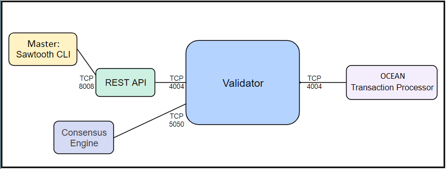
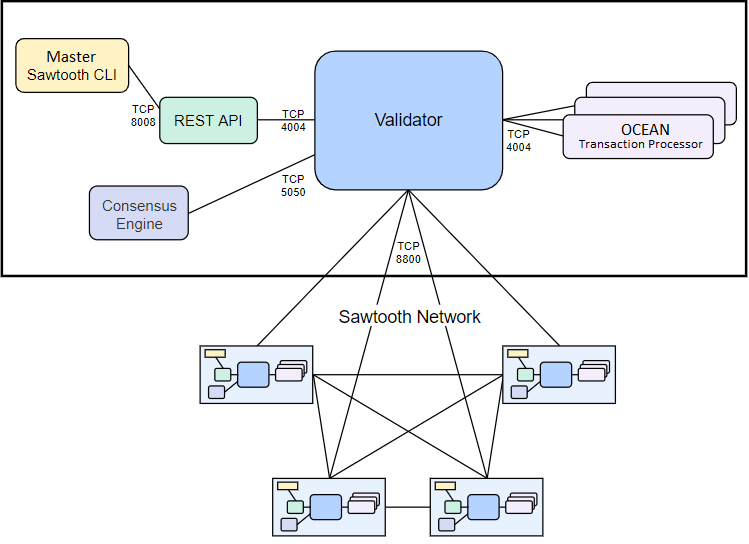

# Network model in case of Single-Node

# Network model in case of multiple validator
https://sawtooth.hyperledger.org/docs/core/releases/latest/app_developers_guide/docker_test_network.html  
Each node in this network runs a validator, REST-API, settings-tp and OCEAN-tp  
**Important:**  Each node in a Sawtooth network must run the same set of transaction processors.

### About consensus algorithm
You can choose either PBFT or PoET consensus.
In my model, i use PoET consensus.

# How to build a network with OCEAN transaction processor?
## First of all, generate a docker image for transaction processor

## Second 